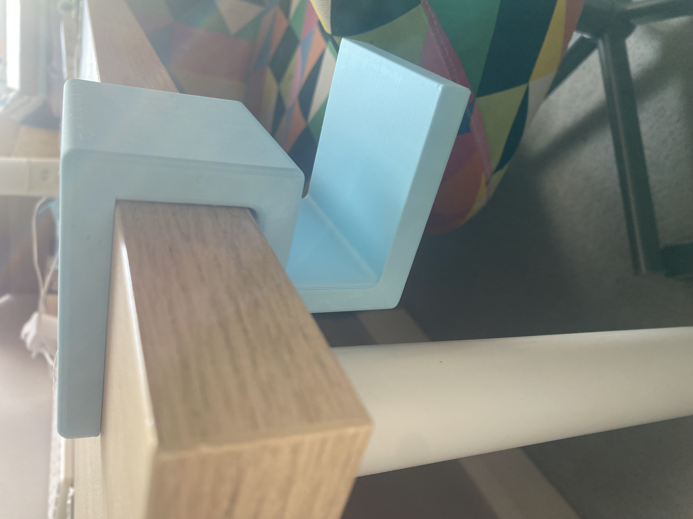
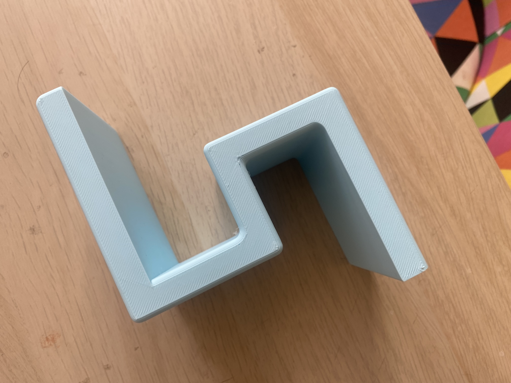
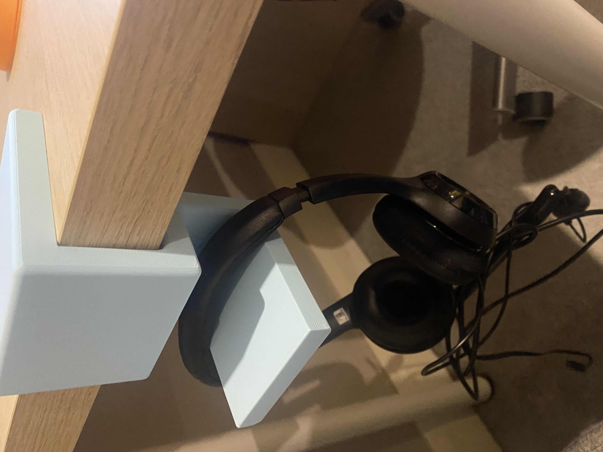

# My headphone stand
#### I have created a headphone stand purposely built for my table at home. Despite seeming to be an easy project at first, it soon become quite difficult and a little annoying for all the wrong reasons.
#### To begin with, the project began with my first model which later upon thinking was clunky, ugly and well... impractical. It was quite big and lacked a lot of functionality. Furthermore, I felt it was not suited for 3D printing and was really just a waste of filament.
#### The second design consisted of a magnet which attached to the table followed by a second attachment which fitted ontop. This design was slightly better than the first in terms of use and design however after reviewing it, I felt it lacked functionality and use and had an overly complicated look and design compared to the first model.
#### The third design was more simple and fitted exactly what I needed but the issue was I had not addressed the issue regarding 3D Printing and wasting filament! I attempted to print it multiple times but kept on running into issues with its thickness which lead me to create a 4th model to finally address all the issues and requirements as best I could!
#### As a result, I decided to create the 4th and final design which aimed to solve the problems of functionality, design and ability to print as well as not wasting filament. The final look was a clean and simple work which fitted to exactly what I needed. It could one printed in under an hour and used just around 75g of filament making it easily printable and portable. Compared to the first 2 models, it had no moving or extra parts, no complex shapes which made printing difficult and no extra useless features as I had on the second model. The print time was around 50 minutes with no mistakes,.

